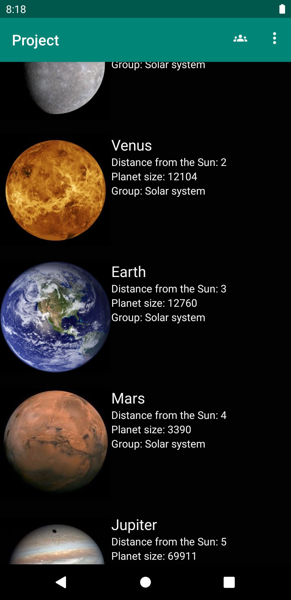
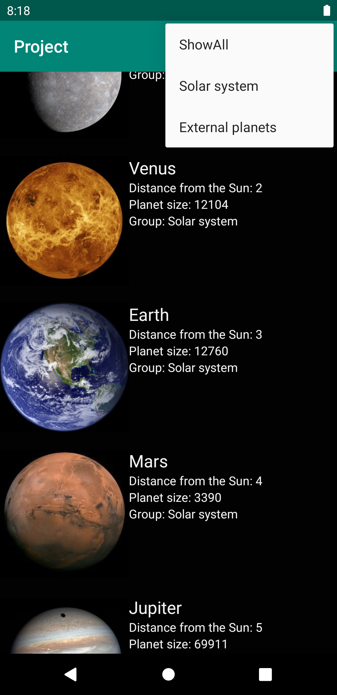
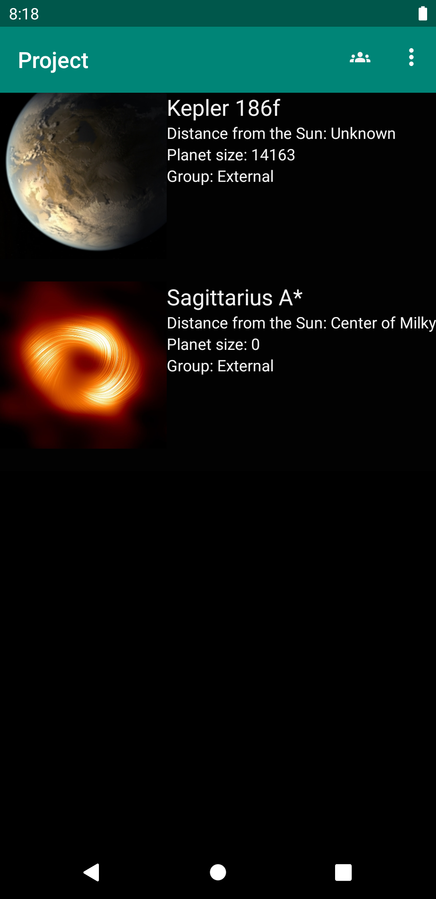
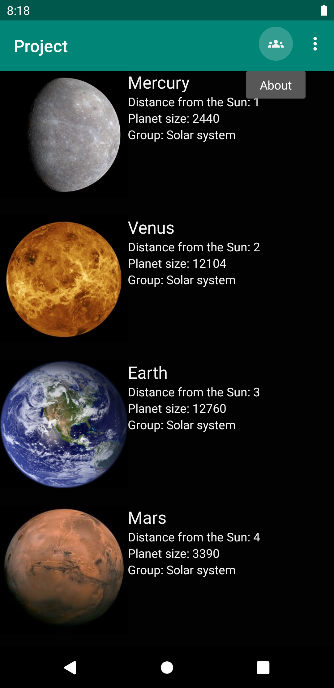
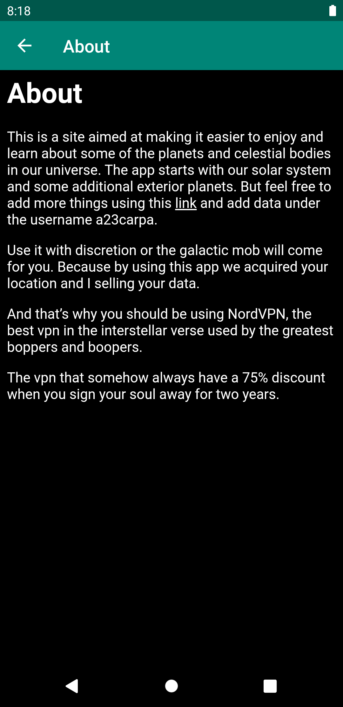
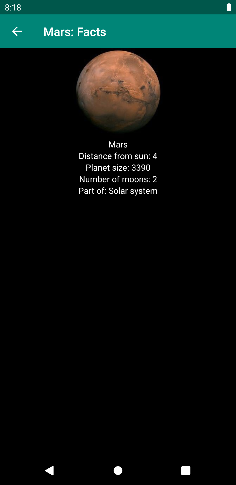

# Rapport

Projectet består av en recycler View i main aktiviteten och en webview i den andra aktiviteten. Recycler Viewn visar data om planeter, datan hämtas från en hemsidan given av skolan för att lägga upp data i JSON format.
I webViewn så körs den en HTML sida med information om appen i sig och des målgrupp. About sidan nås genom att clicka på en icon i layout baren. Där finns det även en droppdown med alternatid för att sortera datan som visas av recysler viewn.

Koden nedan visar metoden som används för att sortera så att recycler viewn endast visar de planter som har värdet "External" som deras kattegori i JSON datan.
Det sker genom att generera en ny lista utifrån listan med alla element och sedan uppdatera recycler viewn när valet görs. Detta sparas även till ett Preference som gör att appen sparar filtret tills ändrat igen.

```
  public void sortExternal(){
        externalPlanets = new ArrayList<>();
        for(RecyclerItem planet : jsonPlanets){
            if(planet.getCategory().equals("External")){
                externalPlanets.add(planet);
            }
        }
        adapter.update(externalPlanets);
        adapter.notifyDataSetChanged();
        myPreferenceEditor.putString("Sort", "External");
        myPreferenceEditor.apply();
    }
```


     
